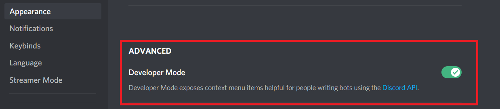

# Config

## `.env`

This is the `.env` file template. Copy this text into the file, and customize according to your needs.

### Template



This template would go in the root project folder, and is used for the main application.

Port 3000 is commonly used by many Node.js applications. Port 4200 is for the dashboard, running on an [Angular development server](./#website-setup).


```javascript
API_URL="http://localhost:3000/api"
BOT_TOKEN=""
CLIENT_ID=""
CLIENT_SECRET=""
DASHBOARD_URL="http://localhost:4200"
DBOTS_AUTH=""
FEEDBACK_CHANNEL_ID=""
GUILD_ID=""
OWNER_ID=""
MONGO_URI="mongodb://localhost/2PG"
PAYPAL_MODE="sandbox"
PAYPAL_CLIENT_ID=""
PAYPAL_SECRET=""
PORT="3000"
PREMIUM_ROLE_ID=""
TOP_GG_AUTH=""
VOTE_CHANNEL_ID="788001309197860874"
```




This template would go in the **test/** directory, and is used for testing.

A different port is used for the API to allow the integration tests to work indendently from the main application. A separate database is also used for this purpose.


```javascript
API_URL="http://localhost:3001/api"
BOT_ID=""
BOT_TOKEN=""
CLIENT_SECRET=""
DASHBOARD_URL="http://localhost:4200"
DBOTS_AUTH=""
FEEDBACK_CHANNEL_ID=""
GUILD_ID=""
OWNER_ID=""
MONGO_URI="mongodb://localhost/2PG-Test"
PORT="3001"
PREMIUM_ROLE_ID=""
STRIPE_SECRET_KEY=""
STRIPE_WEBHOOK_SECRET=""
TOP_GG_AUTH=""
VOTE_CHANNEL_ID="788001309197860874"
```




This template assumes you are deploying 2PG live, and for non development purposes. Replace placeholder values according to your project's needs.


```javascript
API_URL="https://example.com/api"
BOT_ID=""
BOT_TOKEN=""
CLIENT_SECRET=""
DASHBOARD_URL="https://example.com"
DBOTS_AUTH=""
FEEDBACK_CHANNEL_ID=""
GUILD_ID=""
OWNER_ID=""
MONGO_URI="mongodb://localhost/2PG"
PAYPAL_MODE="live"
PAYPAL_CLIENT_ID=""
PAYPAL_SECRET=""
PORT="3000"
PREMIUM_ROLE_ID=""
TOP_GG_AUTH=""
VOTE_CHANNEL_ID="788001309197860874"
```





**.env** should not be saved with Git. This would expose all of your tokens. By default, this file is added to **.gitignore**, which means Git should not commit this file.


### How do I get these values?

The bot values are found at the Discord Developer Portal. These are required for the bot to login and function correctly.




Developer mode needs to be enabled, in Discord settings, to get some of these values.




## Required Variables

### _API\_URL_

The API URL is used to get XP cards via commands, and more. It is also used in API routes for various functions.


### _CLIENT\_ID_

The Bot ID is used for logging into the dashboard \(Discord OAuth2\), and is used to build the authorization URL.


### _**BOT\_TOKEN**_

This is the actual bot token, that allows you to login the bot user using the Discord API. It is used for logging in the bot, and interacting with the Discord API.


### _CLIENT\_SECRET_

The client secret is used for logging in with Discord OAuth2. It lets Discord know that they can trust our application.


### _DASHBOARD\_URL_

The dashboard URL refers to the local, or deployment website. If you were developing locally with the **Dashboard Project** it would be `http://localhost:4200`, by default. If you are deploying this live, you would use the URL of the website home page. It's used for API redirects, commands, and more.


### _MONGO\_URI_

The mongo URI is used for connecting to the MongoDB database. It should follow the MongoDB URI string format. The database is used for customizing guilds, saving user XP, and much more.



### _PORT_

The port is used serving the API. Port **3000** is commonly used with Node.js apps and is used with 2PG, by default. If you use port **80**, and it's not blocked by another process \(e.g. NginX\), it should host your dashboard by default when you connect to the server IP.


## Optional Variables

### OWNER\_ID

The owner ID refers to your Discord user ID. It is used for getting bot stats, but is not required for 2PG to function.


**Developer Mode** needs to be enabled to copy a User ID in Discord.



### PAYPAL\_CLIENT\_ID

Client ID of the PayPal secret, from the PayPal developers website.

### PAYPAL\_MODE

Should be either `sandbox`, for development, or `live`, for live payments. 


### PAYPAL\_SECRET

Client Secret \(hidden - above\) from the PayPal developers website.

### TOP\_GG\_AUTH

Webhook secret from top.gg Discord bot list.

