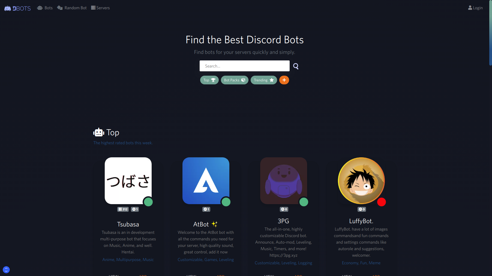

# Overview

## What is DBots?

DBots is a Discord bot list website, built with Angular and TypeScript. It was originally made from [2PG](../2pg/#what-is-2pg) - simple, powerful Discord bot. The first version was originally created in June 2020.

## Why was DBots created?

DBots was created as a better alternative to other Discord bot lists like top.gg.

